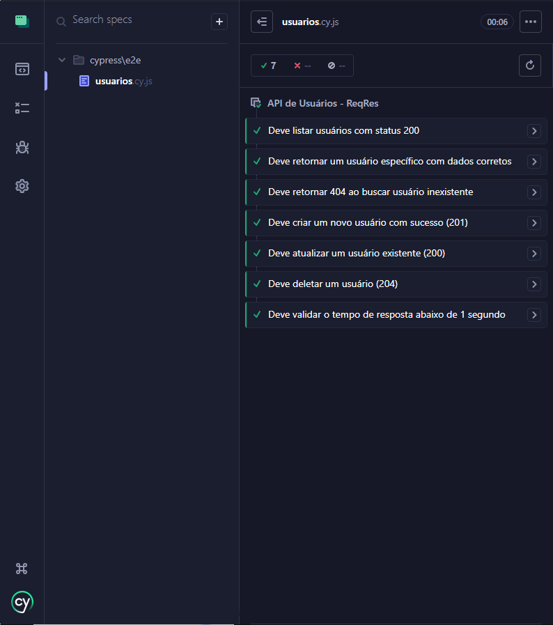

# 🚀 Automação de API com Cypress


Projeto de automação de testes de API desenvolvido durante a Trilha de Cypress da **Digital Innovation One (DIO)**.

## 📌 Sobre o Projeto

Repositório com testes automatizados de API utilizando Cypress, com foco em validar respostas, códigos de status HTTP, estrutura de dados JSON e comportamento de endpoints de forma prática e eficiente.

## 🛠️ Tecnologias Utilizadas

| Tecnologia | Descrição |
|---|---|
| **Cypress** | Framework moderno para testes de API e Web |
| **JavaScript / Node.js** | Ambiente de execução |
| **npm** | Gerenciador de pacotes e dependências |

## ✅ Foco dos Testes

- Validação de códigos de status HTTP (200, 201, 404)
- Verificação de estrutura e contrato JSON
- Suporte aos métodos GET, POST, PUT, DELETE
- Cenários de sucesso e erro
- Validação de tempo de resposta

## 📁 Estrutura do Projeto

    cypress-api-automation/
    ├── cypress/
    │   └── e2e/
    │       └── usuarios.cy.js   # Testes automatizados de API
    ├── evidencias/              # Prints de execução dos testes
    ├── .gitignore
    ├── package.json
    └── README.md

## ▶️ Como Executar

```bash
# Clone o repositório
git clone https://github.com/IdnaReis/cypress-api-automation.git

# Acesse a pasta do projeto
cd cypress-api-automation

# Instale as dependências
npm install

# Execute os testes
npx cypress open
```

## 📸 Evidências

Testes executados com sucesso — 7 de 7 passando:




LINKEDIN
img.shields.io
## 

 Autora

*Idna Reis*  
Profissional em transição para QA | Testes Manuais & Automação


](https://linkedin.com/in/idna-reis) [


](https://github.com/IdnaReis)

