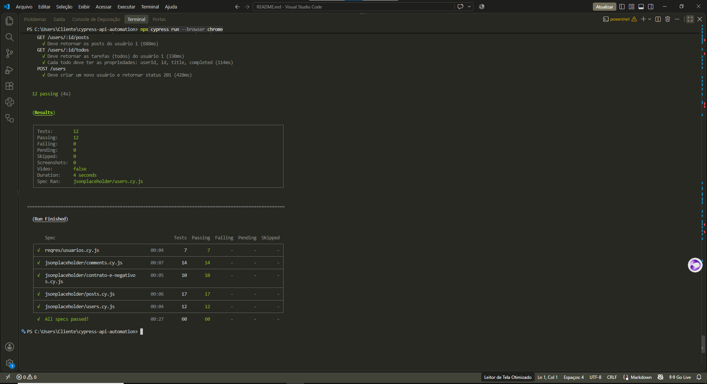
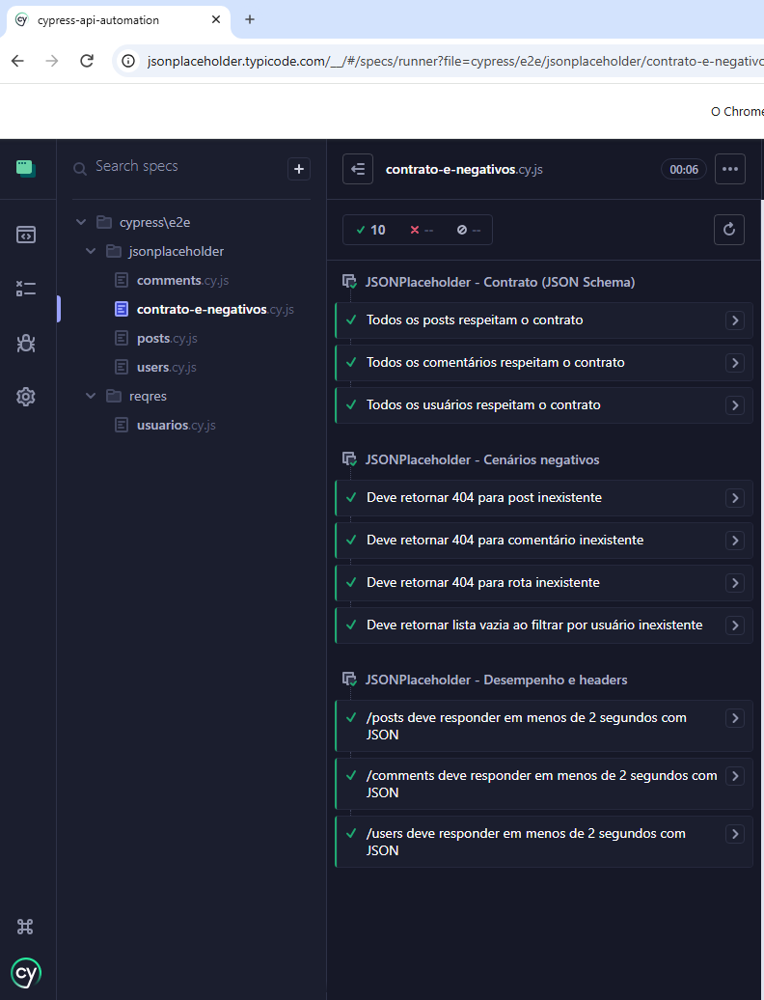
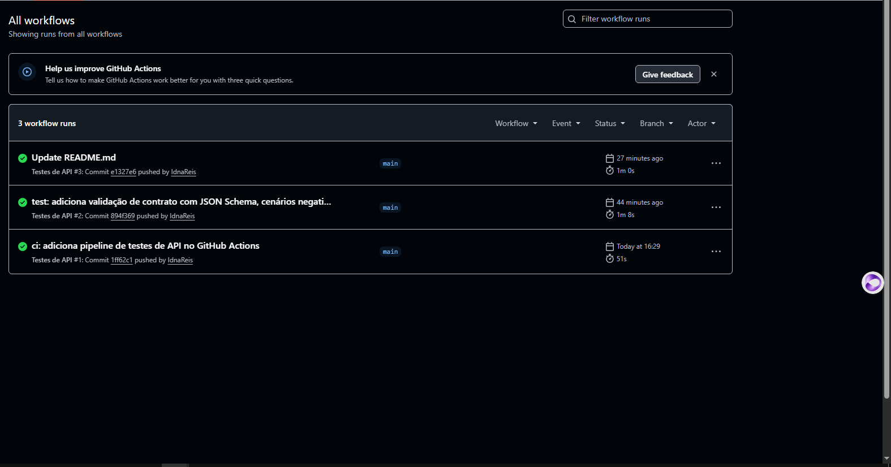

# 🚀 Automação de API com Cypress

[](https://github.com/IdnaReis/cypress-api-automation/actions/workflows/testes-api.yml)


Projeto de automação de testes de API com **60 testes automatizados** em duas APIs públicas, com validação de contrato via **JSON Schema** e execução contínua no **GitHub Actions**. Iniciado na Trilha de Cypress da **Digital Innovation One (DIO)** e evoluído como projeto de portfólio.

## 📌 Sobre o Projeto

Os testes validam códigos de status HTTP, estrutura e contrato das respostas JSON, cenários de erro, tempo de resposta e headers, cobrindo operações de leitura e escrita (GET, POST, PUT, PATCH e DELETE).

| API | O que é testado |
|---|---|
| [JSONPlaceholder](https://jsonplaceholder.typicode.com) | Posts, comentários e usuários: CRUD completo, filtros, contrato e cenários negativos |
| [ReqRes](https://reqres.in) | Usuários: listagem, busca, criação, erro 404 e tempo de resposta |

## 🛠️ Tecnologias Utilizadas

| Tecnologia | Descrição |
|---|---|
| **Cypress.io** | Framework de testes de API e Web |
| **JavaScript / Node.js** | Linguagem e ambiente de execução |
| **Ajv** | Validação de contrato com JSON Schema |
| **GitHub Actions** | Pipeline de integração contínua |
| **npm** | Gerenciador de pacotes e dependências |

## ✅ Foco dos Testes

- Validação de códigos de status HTTP (200, 201, 404)
- **Validação de contrato com JSON Schema**: tipos, campos obrigatórios e rejeição de campos inesperados
- Comandos customizados do Cypress para validar a estrutura de posts, usuários e comentários
- Cenários negativos: recursos e rotas inexistentes, filtros sem resultado
- Tempo de resposta e headers (`content-type: application/json`)

## 📊 Resultados

| Arquivo | Testes |
|---|---|
| `jsonplaceholder/posts.cy.js` | 17 |
| `jsonplaceholder/comments.cy.js` | 14 |
| `jsonplaceholder/users.cy.js` | 12 |
| `jsonplaceholder/contrato-e-negativos.cy.js` | 10 |
| `reqres/usuarios.cy.js` | 7 |
| **Total** | **60 ✅** |

## 📸 Evidências

Execução local: 60 de 60 testes passando.



Validação de contrato e cenários negativos na interface do Cypress:



Pipeline no GitHub Actions:



## 📁 Estrutura do Projeto

```
cypress-api-automation/
├── .github/workflows/
│   └── testes-api.yml             # Pipeline de CI (GitHub Actions)
├── cypress/
│   ├── e2e/
│   │   ├── jsonplaceholder/       # 53 testes: CRUD, contrato e negativos
│   │   └── reqres/                # 7 testes de usuários
│   └── support/
│       ├── commands.js            # Comandos customizados de validação
│       └── e2e.js
├── evidencias/                    # Prints de execução
├── cypress.config.js
├── package.json
└── README.md
```

## 🧠 Decisões Técnicas

- **Testes separados por API**, para facilitar a manutenção e deixar claro o escopo de cada suíte.
- **JSON Schema com Ajv** em vez de verificar campo a campo: um único schema valida o formato completo e acusa campos inesperados, o que ajuda a detectar quebras de contrato.
- **Execução no Chrome** (`--browser chrome`): o navegador padrão (Electron) travava no Windows, e o Chrome deixou a execução estável, local e no CI.
- **Cenários negativos de leitura**: a JSONPlaceholder é uma API de testes que aceita qualquer envio e sempre retorna 201, então os cenários de erro focam em GET. Numa API real, também seriam testados envios com dados inválidos.

## ▶️ Como Executar

```bash
# Clone o repositório
git clone https://github.com/IdnaReis/cypress-api-automation.git

# Acesse a pasta do projeto
cd cypress-api-automation

# Instale as dependências
npm ci

# Execute todos os testes
npx cypress run --browser chrome

# Ou abra a interface do Cypress
npx cypress open
```

## 👩‍💻 Autora

**Idna Reis**
Analista de QA | Automação de Testes Web, API e Mobile

<a href="https://linkedin.com/in/idna-reis"></a>
<a href="https://github.com/IdnaReis"></a>
